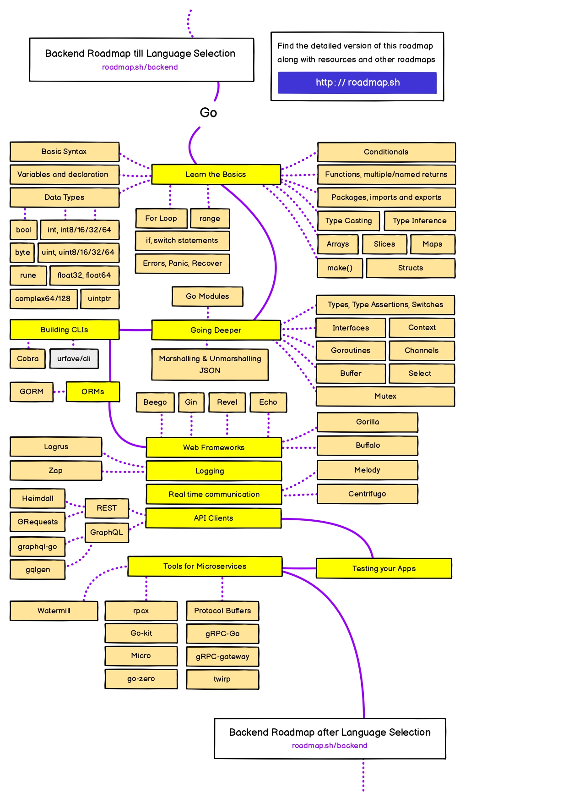

# 😎 Guia do Golang

Bem-vindo ao Guia do Golang! Este repositório é o ponto de partida perfeito para quem quer mergulhar no universo do desenvolvimento go. Aqui, você encontrará uma série de arquivos recheados de conceitos, exemplos práticos e links úteis para o desenvolvimento.

## 🗺️ Roadmap

Gosto muito do site [roadmap.sh](https://roadmap.sh/), pois nele é possível encontrar trilhas e recursos valiosos para o aprendizado de diferentes áreas da TI.  Como pode ser visualizado na figura a seguir a trilha de Golang abrange vários conceitos. 

Não se sinta pressionado a seguir cada passo desta trilha rigidamente. O desenvolvimento golang é uma jornada pessoal, e você pode adaptar seu percurso de acordo com seus interesses, necessidades e objetivos. Use este roadmap como uma bússola, mas sinta-se à vontade para explorar caminhos que despertem mais sua curiosidade.

### Roadmap Backend

## 📚 Conteúdo:

### Golang

#### Sintaxe Básica

- [Iniciando no Go](./Sintaxe%20Básica/Iniciando%20no%20Go.md)
- [Variáveis](./Sintaxe%20Básica/Variáveis.md)
- [Estruturas de Dados](./Sintaxe%20Básica/Estruturas%20de%20Dados.md)
- [Controle de Fluxo](./Sintaxe%20Básica/Controle%20de%20Fluxo.md)
- [Funções](./Sintaxe%20Básica/Funções.md)
- [Tratamento de Erros](./Sintaxe%20Básica/Tratamento%20de%20Erros.md)
- [Pointers](./Sintaxe%20Básica/Pointers.md)
- [Orientação a Objetos](./Sintaxe%20Básica/Orientação%20a%20Objetos.md)
- [Arquivos de Texto](./Sintaxe%20Básica/Arquivos%20de%20Texto.md)
- [Bancos de Dados](./Sintaxe%20Básica/Banco%20de%20Dados.md)

## 🤝 Contribua!

Este guia está em constante crescimento, e sua contribuição é mais do que bem-vinda! Se você tem dicas, exemplos adicionais ou quer corrigir algo, sinta-se à vontade para abrir uma issue ou enviar um pull request. Vamos tornar este guia ainda mais incrível!

Divirta-se codificando! 🚀✨